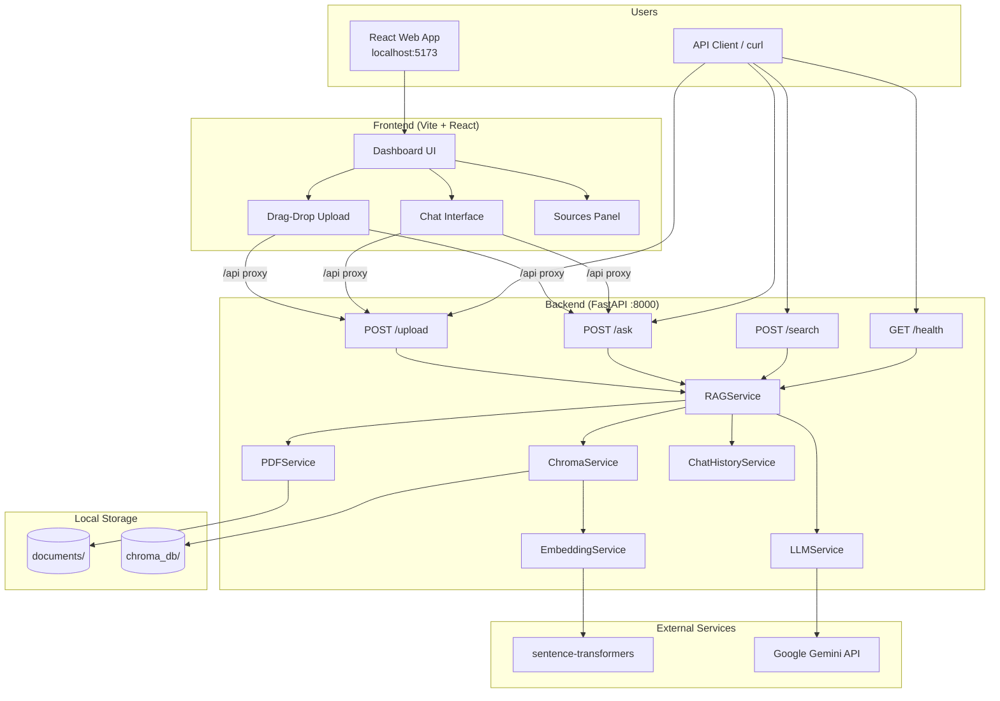
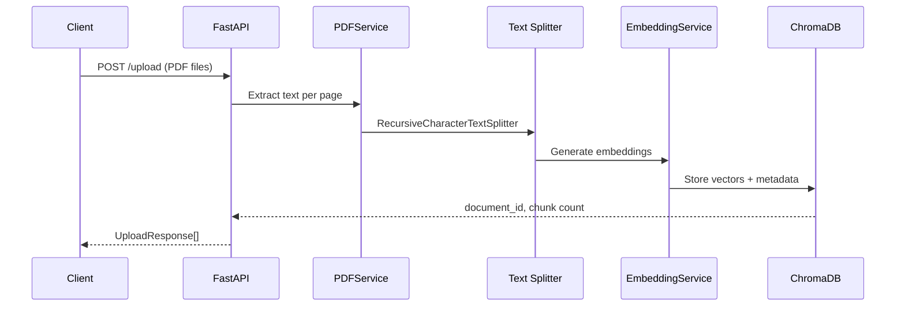
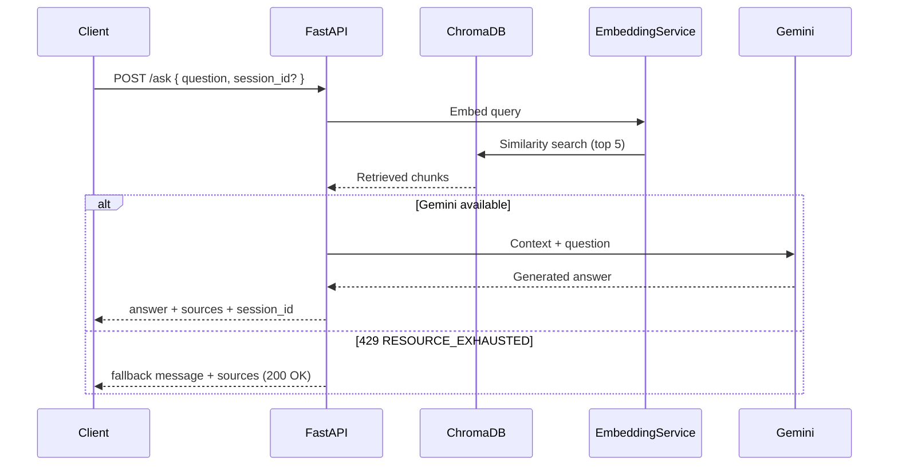
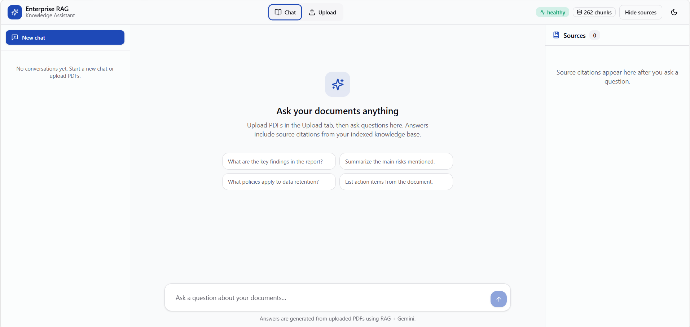
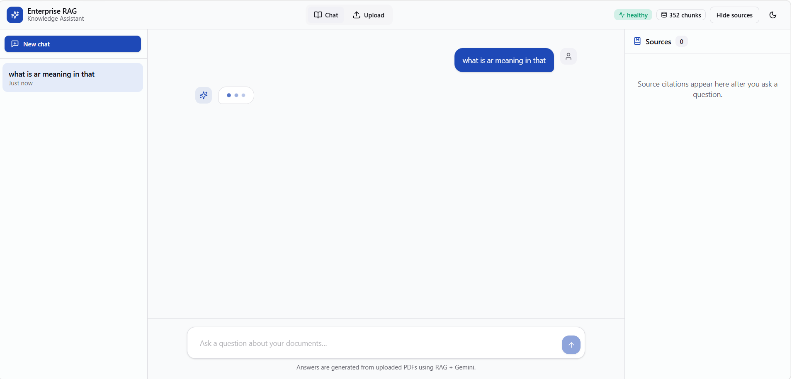
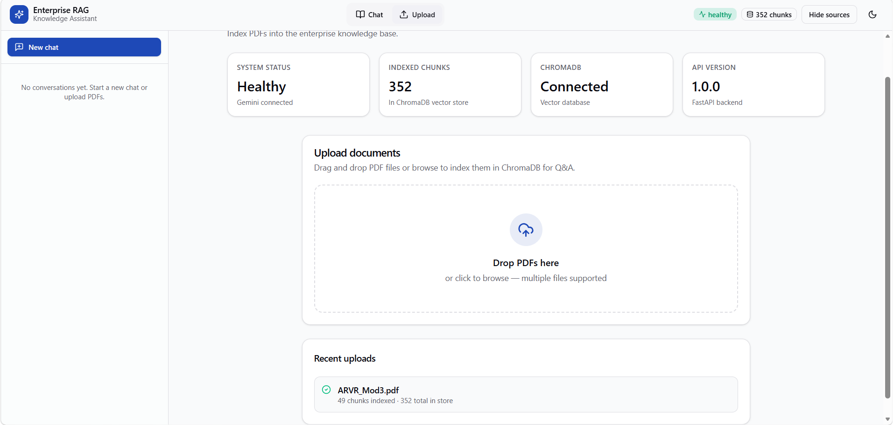
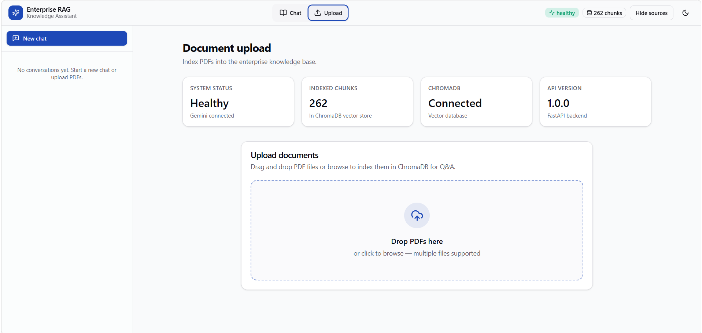

<p align="center">
  <strong>Enterprise RAG Knowledge Assistant</strong>
</p>

<p align="center">
  Production-ready Retrieval-Augmented Generation platform for enterprise document Q&amp;A.<br/>
  Upload PDFs · Index in ChromaDB · Ask questions with Gemini · Cite your sources.
</p>

<p align="center">
  <a href="#installation">Installation</a> ·
  <a href="#architecture">Architecture</a> ·
  <a href="#screenshots">Screenshots</a> ·
  <a href="#api-documentation">API Docs</a> ·
  <a href="#configuration">Configuration</a>
</p>

---

## Overview

**Enterprise RAG Knowledge Assistant** is a full-stack knowledge system that lets teams upload PDF documents, index them into a vector database, and ask natural-language questions grounded in document content.

| Layer | Technology |
|-------|------------|
| **Backend** | Python · FastAPI · LangChain · ChromaDB · Gemini |
| **Embeddings** | sentence-transformers (`all-MiniLM-L6-v2`) |
| **Frontend** | React · TypeScript · Tailwind CSS · shadcn/ui |
| **Deployment** | Docker · docker-compose |

### Key capabilities

- **PDF ingestion** — Extract, chunk, embed, and persist documents
- **Semantic search** — Cosine similarity over ChromaDB vectors
- **Grounded answers** — Gemini responds only from retrieved context
- **Source citations** — Every answer includes chunk-level references
- **Chat history** — Multi-turn conversations via `session_id`
- **Quota fallback** — Graceful degradation when Gemini rate-limits (429)
- **Debug search** — Vector-only retrieval endpoint (no LLM)
- **Modern UI** — Dashboard, drag-and-drop upload, ChatGPT-style chat

---

## Architecture

### System diagram



### RAG pipeline — document ingestion



### RAG pipeline — question answering



---

## Screenshots


### Dashboard

System status, ChromaDB connection, and indexed document statistics.



### Chat Interface

ChatGPT-style conversation interface for asking questions about uploaded PDFs.



### Upload Dashboard

Drag-and-drop PDF upload with indexing feedback.



### Architecture / Project Structure

Project architecture and workflow.



| View | URL |
|------|-----|
| Web app | http://localhost:5173 |
| Swagger UI | http://localhost:8000/docs |
| ReDoc | http://localhost:8000/redoc |
| Health check | http://localhost:8000/health |

---

## Installation

### Prerequisites

| Requirement | Version |
|-------------|---------|
| Python | 3.10+ |
| Node.js | 18+ (for frontend) |
| npm | 9+ |
| Gemini API key | [Google AI Studio](https://aistudio.google.com/apikey) |

### 1. Clone and configure

```powershell
cd "enterprise rag"
```

Copy the environment template and add your Gemini key:

```powershell
copy .env.example .env
```

Edit `.env`:

```env
GEMINI_API_KEY=your_gemini_api_key_here
```

### 2. Backend setup

```powershell
# Create virtual environment
python -m venv venv
.\venv\Scripts\Activate.ps1

# Install dependencies (first run downloads embedding model — may take several minutes)
pip install -r requirements.txt
```

### 3. Start the API server

**Option A — startup script (recommended on Windows):**

```powershell
.\run.ps1
```

**Option B — direct command (no activation required):**

```powershell
.\venv\Scripts\python.exe -m uvicorn app.main:app --reload --host 0.0.0.0 --port 8000
```

Verify the backend:

```powershell
curl http://localhost:8000/health
```

### 4. Frontend setup (optional)

```powershell
cd frontend
npm install
npm run dev
```

Open **http://localhost:5173** — the Vite dev server proxies `/api` → `http://127.0.0.1:8000`.

### 5. Docker (alternative)

```powershell
# Ensure .env contains GEMINI_API_KEY
docker compose up --build
```

API available at http://localhost:8000

---

## Project structure

```
enterprise-rag/
├── app/                          # FastAPI backend
│   ├── main.py                   # App entry, CORS, exception handlers
│   ├── config.py                 # Environment settings
│   ├── dependencies.py           # Service singleton injection
│   ├── routes/
│   │   ├── upload.py             # POST /upload
│   │   ├── ask.py                # POST /ask
│   │   ├── search.py             # POST /search (debug)
│   │   └── health.py             # GET /health
│   ├── services/
│   │   ├── rag_service.py        # Pipeline orchestration
│   │   ├── pdf_service.py        # PDF text extraction
│   │   ├── chroma_service.py     # Vector store operations
│   │   ├── embedding_service.py  # Sentence-transformers
│   │   ├── llm_service.py        # Google Gemini
│   │   └── chat_history_service.py
│   ├── models/schemas.py         # Pydantic request/response models
│   └── utils/                    # Logging, validation, exceptions
├── frontend/                     # React dashboard
│   ├── src/
│   │   ├── components/           # UI, chat, upload, sources
│   │   ├── hooks/                # useChatStore, useTheme
│   │   └── lib/api.ts            # Backend API client
│   └── package.json
├── documents/                    # Uploaded PDF storage
├── chroma_db/                    # Persistent vector index
├── docs/screenshots/             # README visuals
├── requirements.txt
├── Dockerfile
├── docker-compose.yml
├── run.ps1 / run.bat             # Windows startup scripts
└── README.md
```

---

## API documentation

Base URL: `http://localhost:8000`

All error responses: `{"detail": "error message"}`

### Summary

| Method | Endpoint | Description | LLM |
|--------|----------|-------------|-----|
| `GET` | `/health` | Service health & stats | — |
| `POST` | `/upload` | Upload & index PDF(s) | — |
| `POST` | `/ask` | Question answering with citations | Gemini |
| `POST` | `/search` | Vector search only (debug) | — |
| `GET` | `/docs` | Swagger UI | — |

---

### `GET /health`

Returns service status and dependency connectivity.

**Request**

```bash
curl http://localhost:8000/health
```

**Response `200 OK`**

```json
{
  "status": "healthy",
  "version": "1.0.0",
  "chroma_connected": true,
  "gemini_configured": true,
  "documents_indexed": 42
}
```

| Field | Type | Description |
|-------|------|-------------|
| `status` | string | `healthy` or `degraded` |
| `version` | string | API version |
| `chroma_connected` | boolean | Vector DB reachable |
| `gemini_configured` | boolean | `GEMINI_API_KEY` is set |
| `documents_indexed` | integer | Total chunks in ChromaDB |

---

### `POST /upload`

Upload one or more PDF files. Each file is saved, chunked, embedded, and stored in ChromaDB.

**Content-Type:** `multipart/form-data`

**Form field:** `files` — one or more PDF files

**Request — single file**

```bash
curl -X POST "http://localhost:8000/upload" \
  -F "files=@report.pdf"
```

**Request — multiple files**

```bash
curl -X POST "http://localhost:8000/upload" \
  -F "files=@doc1.pdf" \
  -F "files=@doc2.pdf"
```

**Response `200 OK`** — always a JSON array

```json
[
  {
    "message": "Document uploaded and indexed successfully.",
    "filename": "report.pdf",
    "document_id": "a1b2c3d4-e5f6-7890-abcd-ef1234567890",
    "chunks_indexed": 28,
    "total_documents_in_store": 28
  }
]
```

| Field | Type | Description |
|-------|------|-------------|
| `filename` | string | Saved PDF name |
| `document_id` | string | UUID for this document |
| `chunks_indexed` | integer | Chunks created from this upload |
| `total_documents_in_store` | integer | Total chunks across all documents |

**Errors**

| Code | Cause |
|------|-------|
| 400 | Invalid PDF, empty file, no extractable text, file too large |
| 500 | ChromaDB or embedding failure |

---

### `POST /ask`

Ask a question against indexed documents. Retrieves top-k chunks, sends context to Gemini, and returns an answer with source citations.

**Content-Type:** `application/json`

**Request body**

| Field | Type | Required | Default | Description |
|-------|------|----------|---------|-------------|
| `question` | string | yes | — | User question (1–4000 chars) |
| `session_id` | string | no | — | Backend session for multi-turn chat |
| `top_k` | integer | no | `5` | Chunks to retrieve (1–20) |

**Request**

```bash
curl -X POST "http://localhost:8000/ask" \
  -H "Content-Type: application/json" \
  -d "{\"question\": \"What are the main risks mentioned in the report?\"}"
```

**Follow-up with chat history**

```bash
curl -X POST "http://localhost:8000/ask" \
  -H "Content-Type: application/json" \
  -d "{\"question\": \"How can we mitigate them?\", \"session_id\": \"<session_id from prior response>\"}"
```

**Response `200 OK`**

```json
{
  "answer": "According to the uploaded documents, the main risks include…",
  "sources": [
    {
      "content": "The primary operational risks identified include…",
      "document_name": "report.pdf",
      "chunk_index": 3,
      "page": 12,
      "relevance_score": 0.87,
      "citation": "report.pdf, p. 12 [chunk 3]"
    }
  ],
  "session_id": "f47ac10b-58cc-4372-a567-0e02b2c3d479",
  "question": "What are the main risks mentioned in the report?",
  "fallback_mode": false
}
```

| Field | Type | Description |
|-------|------|-------------|
| `answer` | string | LLM-generated answer (or quota fallback message) |
| `sources` | array | Retrieved chunks used as context |
| `session_id` | string | Pass back for follow-up questions |
| `fallback_mode` | boolean | `true` when Gemini quota exceeded (429) |

**Quota fallback (429)**

When Gemini returns `RESOURCE_EXHAUSTED`, the endpoint still returns **200 OK** with `fallback_mode: true`, a friendly quota message in `answer`, and retrieved chunks in `sources`.

**Errors**

| Code | Cause |
|------|-------|
| 502 | Gemini / LLM failure (non-quota) |
| 503 | Missing `GEMINI_API_KEY` |
| 500 | Vector store failure |

---

### `POST /search`

Debug endpoint — ChromaDB similarity search **only**. Does not call Gemini.

**Content-Type:** `application/json`

**Request body**

| Field | Type | Required | Description |
|-------|------|----------|-------------|
| `question` | string | yes | Search query |

**Request**

```bash
curl -X POST "http://localhost:8000/search" \
  -H "Content-Type: application/json" \
  -d "{\"question\": \"What are the compliance requirements?\"}"
```

**Response `200 OK`**

```json
{
  "retrieved_chunks": [
    {
      "content": "All data must be retained for a minimum of seven years…",
      "document_name": "policy.pdf",
      "chunk_index": 1,
      "page": 4,
      "relevance_score": 0.91,
      "citation": "policy.pdf, p. 4 [chunk 1]"
    }
  ]
}
```

Returns the **top 5** chunks by cosine similarity.

---

## Configuration

Environment variables (`.env`):

| Variable | Default | Description |
|----------|---------|-------------|
| `GEMINI_API_KEY` | — | **Required** for `/ask` |
| `GEMINI_MODEL` | `gemini-2.0-flash` | Gemini model name |
| `CHUNK_SIZE` | `1000` | Characters per text chunk |
| `CHUNK_OVERLAP` | `200` | Overlap between chunks |
| `RETRIEVAL_TOP_K` | `5` | Default chunks retrieved |
| `EMBEDDING_MODEL_NAME` | `all-MiniLM-L6-v2` | Sentence-transformers model |
| `MAX_UPLOAD_SIZE_MB` | `25` | Maximum PDF upload size |

Frontend ( `frontend/.env` ):

| Variable | Default | Description |
|----------|---------|-------------|
| `VITE_API_URL` | `/api` | Backend API base URL |

---

## Error handling

| HTTP | Endpoint(s) | Cause |
|------|-------------|-------|
| 400 | `/upload` | Invalid PDF, empty file, no extractable text |
| 502 | `/ask` | Gemini / LLM failure (non-quota) |
| 503 | `/ask` | Missing `GEMINI_API_KEY` |
| 500 | All | ChromaDB, embedding, or unexpected server error |

---

## Development

### Backend logs

Structured stdout logging for uploads, queries, and errors.

### Frontend production build

```powershell
cd frontend
npm run build
npm run preview
```

Set `VITE_API_URL` to your production API URL before building.

### Interactive API testing

- Swagger UI: http://localhost:8000/docs
- ReDoc: http://localhost:8000/redoc

---

## Tech stack

**Backend**

- [FastAPI](https://fastapi.tiangolo.com/) — REST API framework
- [LangChain](https://python.langchain.com/) — text splitting, embeddings, LLM integration
- [ChromaDB](https://www.trychroma.com/) — persistent vector store
- [sentence-transformers](https://www.sbert.net/) — local embedding model
- [Google Gemini](https://ai.google.dev/) — answer generation
- [pypdf](https://pypdf.readthedocs.io/) — PDF text extraction

**Frontend**

- [React 19](https://react.dev/) + [TypeScript](https://www.typescriptlang.org/)
- [Vite](https://vitejs.dev/) — build tooling
- [Tailwind CSS v4](https://tailwindcss.com/) — styling
- [shadcn/ui](https://ui.shadcn.com/) — component patterns
- [Lucide](https://lucide.dev/) — icons

---

## License

MIT — or your organization's license.
